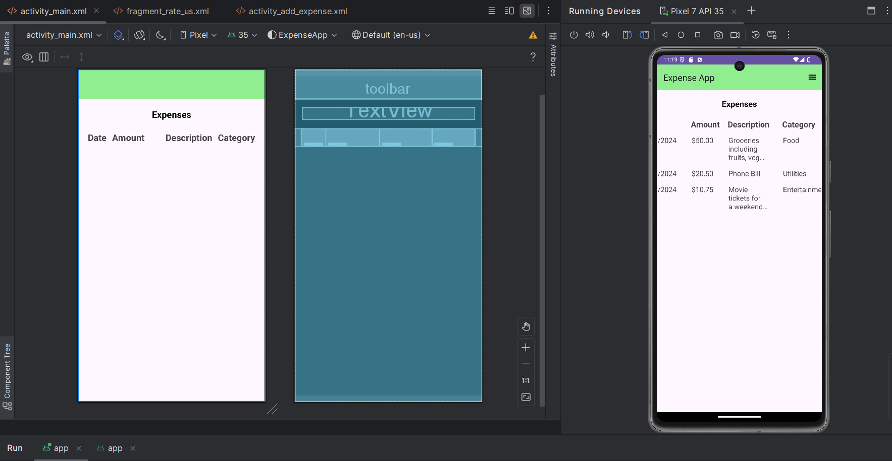
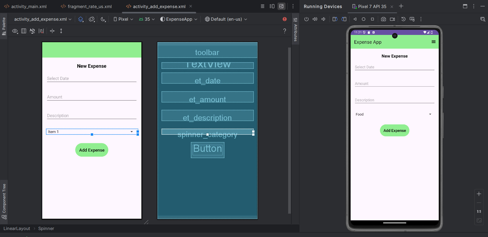
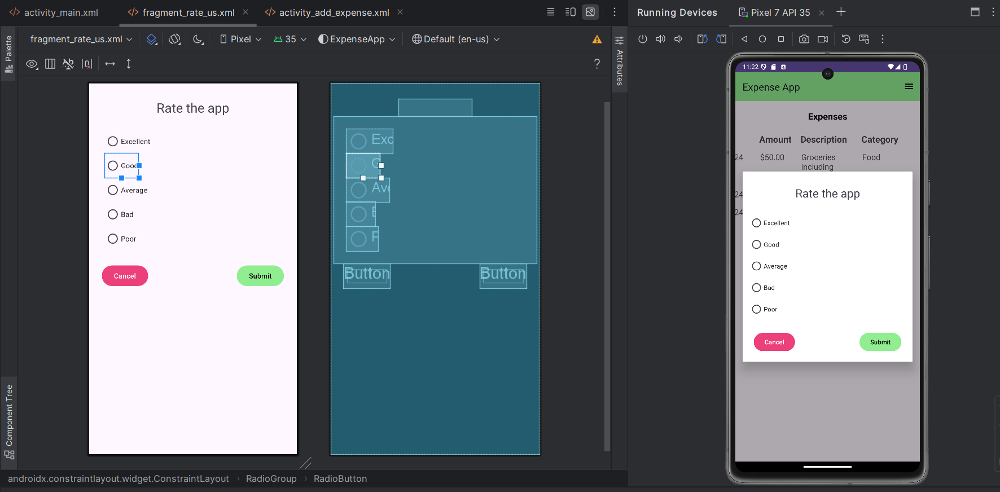
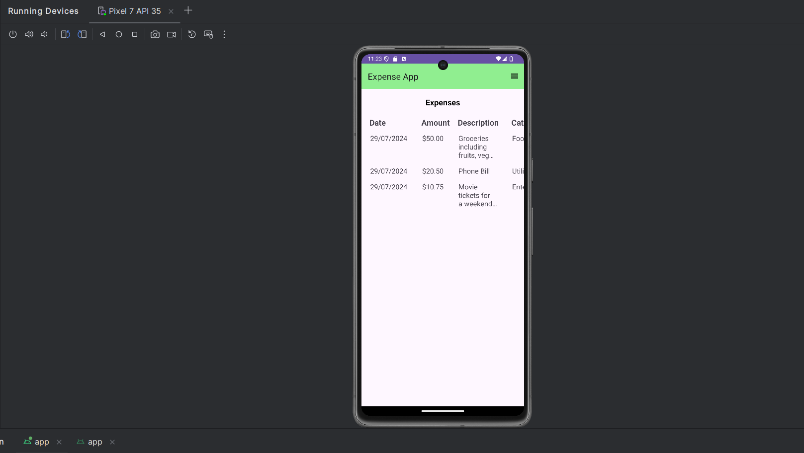
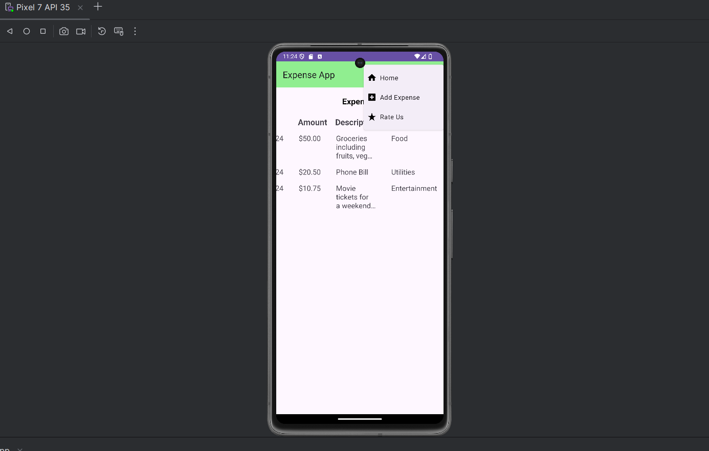
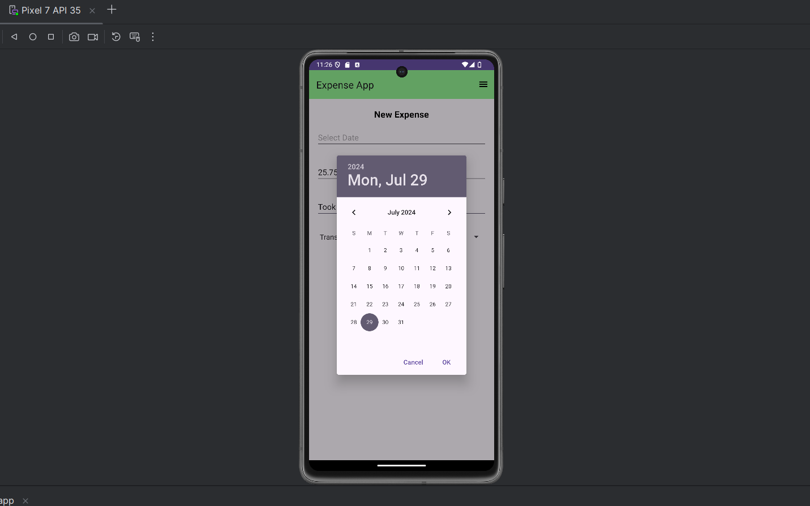
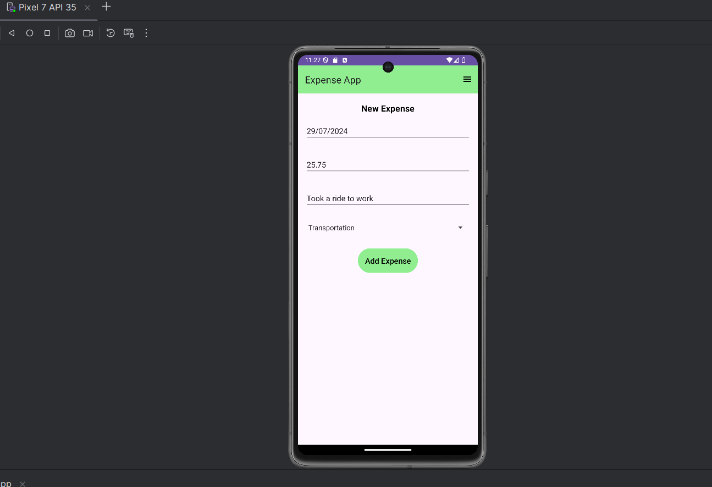
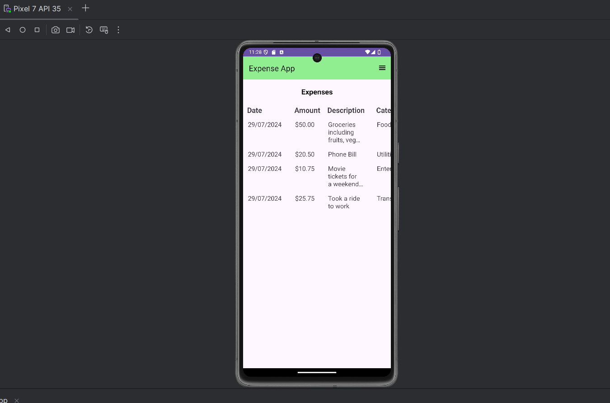
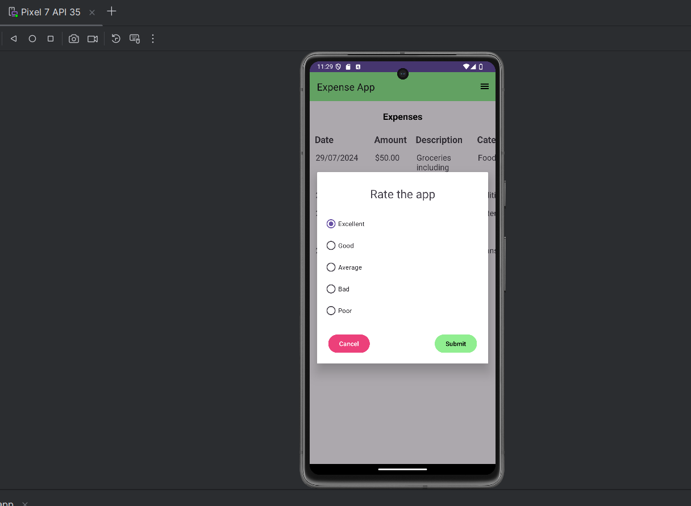
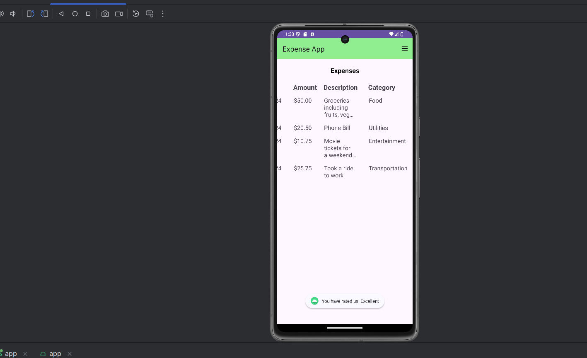

# Expense App

This Kotlin based based Android application helps user to keep track of their expenses. User can add expenses of various categories (food, utilities, transportation, entertainment and other).

## Features

- Add new expenses of different categories and view them.
- Rating system - rate the app.

## Design
<div align="center">
    
    
    
</div>
## Output

* Home page
<div align="center">
    
    
</div>
* Add expense
<div align="center">
    
    
    
</div>
* Rate us
<div align="center">
    
    
</div>

## Technologies Used
* Kotlin
* Android Studio
* XML

## Installation

Clone the repository and open the project in Android Studio.

```bash
git clone https://github.com/anik-dutta/kotlin_expense-app.git
```

## Usage
1. Open the project in Android Studio.
2. Build and run the app on an emulator or physical device.
